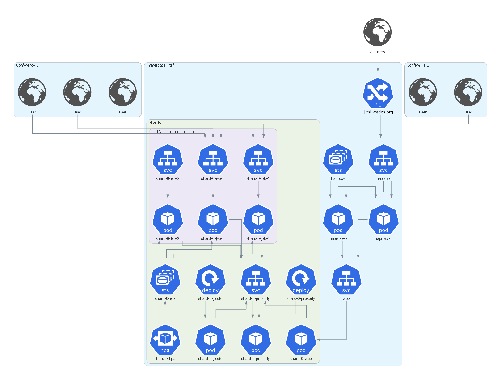

P.S. PRs with fixes or improves are welcome ;-)

# About
A [Jitsi Meet](https://jitsi.org/jitsi-meet/) Chart for Kubernetes with 2 replicas of  [HAproxy](https://github.com/haproxytech/haproxy-docker-debian/tree/master/2.1) in peering. All Jitsi shard are in backend via `server-template` in configuration.

This chart will install and configure: HAProxy statefulset, [Jicofo](https://github.com/jitsi/jicofo) deployment, [JVB](https://github.com/jitsi/jitsi-videobridge) statefulset (scalable), [web](https://hub.docker.com/r/jitsi/web/) interface, [prosody](https://hub.docker.com/r/jitsi/prosody/) XMPP server.

## Architecture

The Jitsi Kubernetes namespace has the following architecture:



The setup shown above contains only a single shard (for visual clarity). Subsequent shards would be attached to the web
service. A more detailed explanation of the system architecture with multiple shards can be found in [architecture/architecture.md](architecture/architecture.md).

## Install chart
To download and to install the Jitsi Meet Chart, make sure that you have the Helm CLI (v2+) installed and clone this repository on your machine.


To install the chart, in your terminal, go to the `jitsi-helm` repository and run the following command:

```bash
helm install -n jitsi ./ --wait
```

If you want to use your own custom watermark, first create configmap from your png file:

```bash
kubectl create configmap -n <namespace> watermark --from-file=watermark.png
```


It assumes that you have a [Nginx Ingress](https://docs.nginx.com/nginx-ingress-controller/overview/) controller and you use [CertManager](https://cert-manager.io/docs/installation/kubernetes/) along with [ACME](https://cert-manager.io/docs/configuration/acme/) issuer type for managing the HTTPS certificates.

Because `--wait` flag, the status will be given once Jisti Meet is ready.

## Updating the chart
To update the chart, in your terminal, go to the `jitsi-helm` repository and run the following command:

```bash
helm upgrade jitsi ./ --wait
```

## Delete the chart
To delete the chart, in your terminal, go to the `jitsi-helm` repository and run the following command:

```bash
helm delete --purge jitsi
```


## Configuration

The following table lists the configurable parameters of the Jitsi Meet chart and their default values.

| Parameter                          | Description                                             | Default           |
|------------------------------------|---------------------------------------------------------|-------------------|
| `shardCount`                       | Number of shards                                        | `2`               |
| `namespace`                        | Namespace                                               | `jitsi`           |
| `haproxy.name`                     | Haproxy statefulset name                                | `jitsi/jicofo`    |
| `haproxy.image`                    | Docker image                                            | `haproxy:2.1`     |
| `ingress.enabled`                  | Enable ingress                                          | `true`            |
| `ingress.hosts`                    | List of hosts in this ingress                           | empty             |
| `ingress.class  `                  | Which ingressClassName to use                           | empty             |
| `ingress.tls.enabled`              | Enable TLS for ingress                                  | `true`            |
| `ingress.tls.secretName`           | Name of the secret storing the TLS certificate and key  | `jitsi-tls`       |
| `ingress.extraPaths    `           | Extra paths to add to the ingress                       | `[]`              |
| `jicofo.name`                      | Jicofo deployment name                                  | `jicofo`          |
| `jicofo.image`                     | Jicofo docker image                                     | `jitsi/jicofo`    |
| `jicofo.imagePullPolicy`           | Jicofo image pull policy                                | `Always`          |
| `jicofo.extraEnvs`                 | Jicofo extra environment variables                      | `[]`              |
| `jvb.name`                         | JVB statefulset name                                    | `jitsi/jvb`       |
| `jvb.image`                        | JVB docker image                                        | `jitsi/jvb`       |
| `jvb.image.imagePullPolicy`        | JVB image pull policy                                   | `Always`          |
| `jvb.replicas`                     | JVB replica count                                       | `1`               |
| `jvb.monitoringEnable`             | JVB exporter container                                  | `true`            |
| `jvb.hostPort`                     | JVB hostPort                                            | empty             |
| `jvb.nodeportPrefix`               | JVB Node port prefix                                    | `30`              |
| `jvb.extraEnvs`                    | JVB extra environment variables                         | `[]`              |
| `prosody.name`                     | Prosody deployment name                                 | `jitsi/prosody`   |
| `prosody.image`                    | Prosody docker image                                    | `jitsi/prosody`   |
| `prosody.image.imagePullPolicy`    | Prosody image pull policy                               | `Always`          |
| `prosody.extraEnvs`                | Extra env var for prosody deployment                    | `[]`              |
| `prosody.extraVolumes`             | Additionnal volumes to the prosody deployment           | `[]`              |
| `prosody.extraVolumeMounts`        | Additional volume mounts to the prosody deployment      | `[]`              |
| `prosody.globalModules`            | Additional global modules to enable on prosody          | `[]`              |
| `prosody.globalConfig`             | Additional global config parameters on prosody          | `[]`              |
| `web.name`                         | Web deployment name                                     | `web`             |
| `web.image`                        | Web docker image                                        | `jitsi/web`       |
| `web.image.imagePullPolicy`        | Web image pull policy                                   | `Always`          |
| `web.extraEnvs`                    | Extra env var for web deployment                        | `[]`              |
| `web.extraVolumes`                 | Additionnal volumes to the web deployment               | `[]`              |
| `web.extraVolumeMounts`            | Additional volume mounts to the web deployment          | `[]`              |
| `watermark`                        | Watermark logo                                          | `true`            |

## Running two jitsi instances inside the same cluster

1. The second instance should be deployed with specific settings :
  - `jvb.nodeportPrefix` should use a different value from `30` to avoid ports conflicts or
  - `jvb.hostPort` that's distinct from other installations
